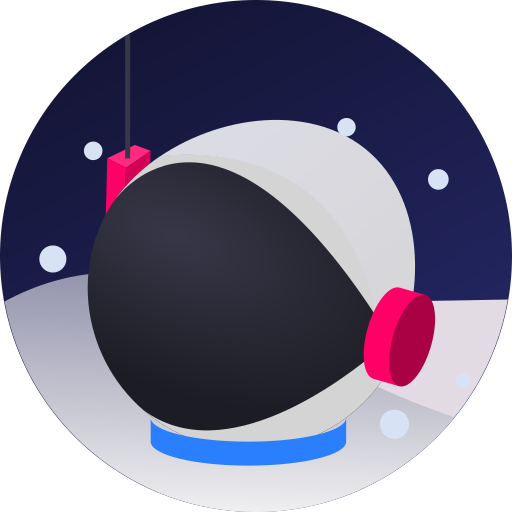

  
  <h2 align="center">the space snowman</h2>
  
Le modder de Minecraft

##

### About Me

[check this out](GREENTEXT.md)

### My Current Goals
actually doing productive things instead of fw my ADHD

## Things I Use

### Languages

| Java | GDScript |
|:----:|:--------:|
|   |  | 

### Development Tools

| Godot | VSCode |
|:-----:|:------:|
|  |  

### OS
| Windows | macOS | Android |
|:-------:|:-----:|:-------:|
|  |  |  |

### Frameworks
| Minecraft Forge |
|:---------------:|
|  |
### Graphics Tools
| Blender | Blockbench | GIMP | Inkscape | Krita |
|:-------:|:----------:|:----:|:--------:|:-----:|
|  |  | |  |  |

### Audio Tools
| Audacity | Garageband |
|:--------:|:----------:|
|  |  | 
