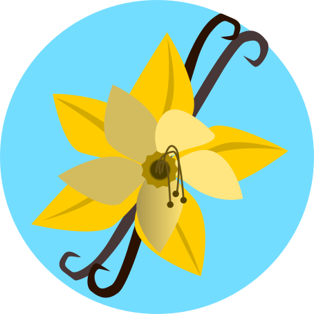

  
  <h2 align="center">squareVanilla</h2>
  
☠️Student / ☕️Junior Java Learner / ⚙️Godot Enjoyer 

##

### About Me
I'm a *Lazy* Student(Which my GitHub Stats describe) who is Learning C++ in School, and self-teaching Godot and Java. I have a Dream of Making a Game with My skills. and I'm Currently Studying for It.
I also have a Strong Passion for the World of Minecraft Modding. so as long as My Laziness doesn't Overwrite My Passion, I'll Always do My Best for My Dreams.

### Social Media?
I currently have no SNS Account. Since I'm not an Extrucive human. I'm allergic to Instagram...

## Things I Use

### Languages

| Java | GDScript |
|------|----------|
|   |   |

### Development Tools

| Godot | VSCode | IntelliJ |
|-------|--------|----------|
|  |  |  |

### OS
(Really)
| Windows |
|---------|
|  |

### Other Tools
| Blender | GIMP | Inkscape |
|---------|------|----------|
|  |  |  |
